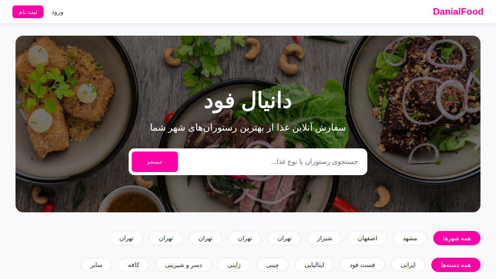
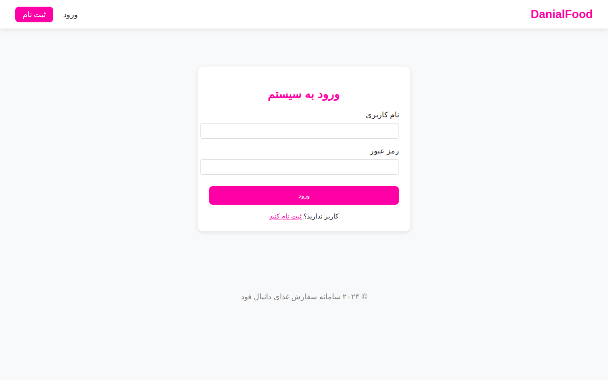
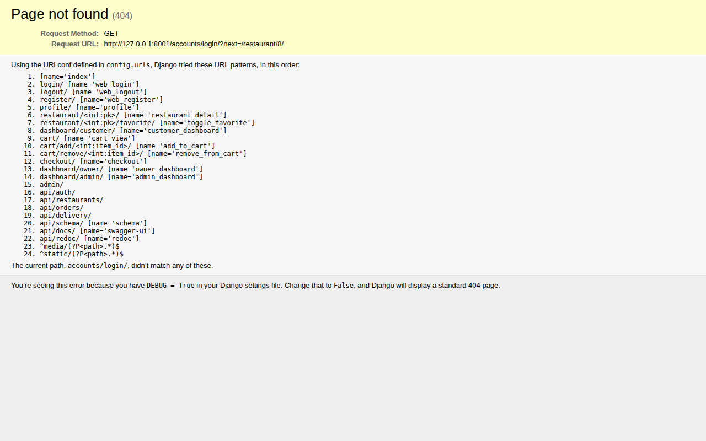
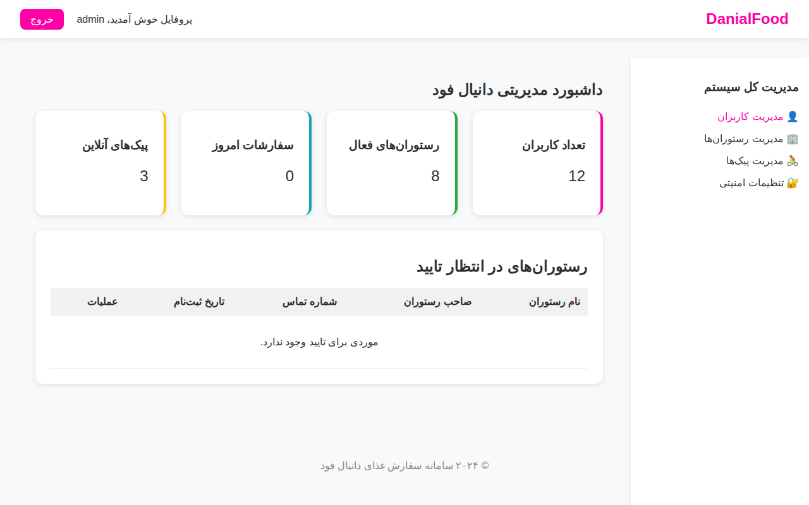

# 🍔 دانیال فود - سامانه هوشمند سفارش غذا

دانیال فود یک سیستم پیشرفته برای مدیریت رستوران و تحویل غذا است که با قابلیت‌های چند‌نقشی (مشتری، صاحب رستوران، پیک و مدیر)، ردیابی موقعیت جغرافیایی و قیمت‌گذاری پویا طراحی شده است. این پروژه شامل یک پنل وب کامل و رابط برنامه‌نویسی (API) برای اتصال به اپلیکیشن‌های موبایل است.

---

## 🛠 ساختار پروژه

این برنامه با استفاده از فریم‌ورک **Django** توسعه یافته و از بخش‌های اصلی زیر تشکیل شده است:

### ۱. بخش حساب‌های کاربری (Accounts)
- مدیریت کاربران در ۴ نقش: مشتری، صاحب رستوران، پیک و مدیر سیستم.
- سیستم مدیریت آدرس‌های متعدد برای مشتریان.
- احراز هویت دوگانه (Session برای وب و JWT برای اپلیکیشن موبایل).

### ۲. بخش رستوران‌ها (Restaurants)
- مدیریت رستوران‌ها، منوها و دسته‌بندی غذاها.
- سیستم فیلترینگ هوشمند بر اساس شهر و فاصله جغرافیایی (شعاع ۱۰ کیلومتری).
- قابلیت ثبت نظر و امتیازدهی توسط مشتریان.
- لیست علاقه‌مندی‌ها.

### ۳. بخش سفارشات (Orders)
- مدیریت سبد خرید و فرآیند تسویه‌حساب.
- تولید شماره سفارش منحصر‌به‌فرد.
- پیگیری وضعیت سفارش به صورت بصری (Visual Tracking).

### ۴. بخش تحویل (Delivery)
- مدیریت پیک‌ها و تخصیص سفارش.
- پیگیری زنده موقعیت پیک (آماده برای اتصال به نقشه).

---

## 🚀 راه‌اندازی پروژه

برای اجرای پروژه روی سیستم خود، مراحل زیر را دنبال کنید:

### ۱. پیش‌نیازها
- Python 3.11 یا بالاتر

### ۲. نصب و تنظیمات
```bash
# کلون کردن مخزن
git clone https://github.com/yourusername/snapfood.git
cd snapfood

# ایجاد محیط مجازی و فعال‌سازی آن
python -m venv venv
source venv/bin/activate  # در ویندوز: venv\Scripts\activate

# نصب وابستگی‌ها
pip install -r requirements/base.txt
pip install -r requirements/dev.txt
```

### ۳. تنظیمات پایگاه داده و مهاجرت‌ها
```bash
python manage.py makemigrations accounts restaurants orders delivery
python manage.py migrate
```

### ۴. ایجاد داده‌های اولیه (Seed Data)
برای تست برنامه با داده‌های نمونه (رستوران‌ها، کاربران و منوها)، دستور زیر را اجرا کنید:
```bash
python seed_data.py
```

### ۵. اجرای سرور
```bash
python manage.py runserver
```
- **پنل وب**: [http://localhost:8000](http://localhost:8000)
- **پنل مدیریت جنگو**: [http://localhost:8000/admin/](http://localhost:8000/admin/)
- **مستندات API**: [http://localhost:8000/api/docs/](http://localhost:8000/api/docs/)

---

## 👥 نقش‌های کاربری و دسترسی‌ها

| نقش | قابلیت‌های کلیدی |
|------|--------------|
| **مشتری** | جستجوی رستوران، فیلتر دسته‌بندی، ثبت سفارش، مدیریت آدرس، پیگیری سفارش. |
| **صاحب رستوران**| مدیریت منو (غذاها و دسته‌ها)، مشاهده سفارشات جاری، گزارش فروش روزانه. |
| **پیک** | مشاهده سفارشات نزدیک، به‌روزرسانی وضعیت ارسال. |
| **مدیر (Admin)** | نظارت بر کل سیستم، تایید رستوران‌های جدید، مدیریت کاربران. |

---

## 📖 راهنمای اتصال به اپلیکیشن (API)

اگر قصد دارید اپلیکیشن اندروید یا iOS خود را به این بک‌ند متصل کنید، مستندات کامل فارسی را در فایل زیر بخوانید:

👉 **[READMEAPI.md (مستندات فارسی API)](READMEAPI.md)**

---

## 📸 تصاویر برنامه (Screenshots)

در اینجا نمایی از بخش‌های مختلف پنل وب دانیال فود را مشاهده می‌کنید:

### ۱. صفحه اصلی و جستجوی رستوران‌ها


### ۲. صفحه ورود به سیستم


### ۳. جزئیات رستوران و منو


### ۴. پنل مدیریت کل سیستم (Admin)


---

## 🛠 تکنولوژی‌های استفاده شده
- **Back-end**: Django 4.2 & Django REST Framework
- **Database**: SQLite (توسعه) / PostgreSQL (عملیاتی)
- **Auth**: JWT & Session-based
- **UI**: Plain HTML/CSS (کاملاً پاسخگو و راست‌چین شده)
